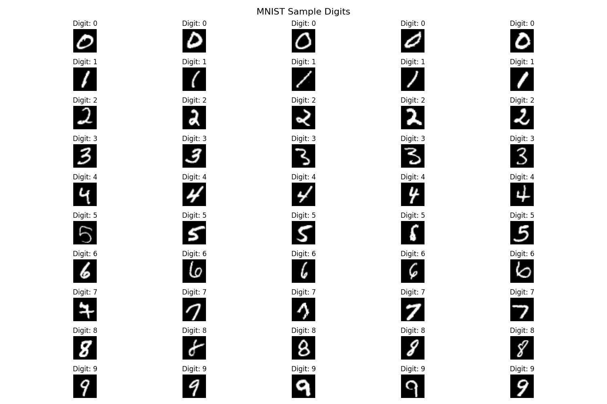

<div style="font-size:2.5em; font-weight:bold; text-align:center; margin-top:20px;">MNIST Digit Recognition using Artificial Neural Networks</div>

<div align="center">
    
</div>

# 1. Project Overview

This project implements an Artificial Neural Network (ANN) to recognize handwritten digits from the MNIST dataset. The entire project is containerized using Docker for easy setup and reproducibility.

# 2. Table of Contents

- [1. Project Overview](#1-project-overview)
- [2. Table of Contents](#2-table-of-contents)
- [3. Prerequisites](#3-prerequisites)
- [4. Project Structure](#4-project-structure)
- [5. Getting Started](#5-getting-started)
  - [5.1. Clone the Repository](#51-clone-the-repository)
  - [5.2. Start the Docker Container](#52-start-the-docker-container)
  - [5.3. Access Jupyter Notebook](#53-access-jupyter-notebook)
- [6. Project Components](#6-project-components)
  - [6.1. Data Preparation](#61-data-preparation)
  - [6.2. Data Exploration](#62-data-exploration)
  - [6.3. Model Training](#63-model-training)
  - [6.4. Evaluation and Visualization](#64-evaluation-and-visualization)
- [7. Results](#7-results)
- [8. License](#8-license)

# 3. Prerequisites

- Docker and Docker Compose installed on your system
- Git for cloning the repository

No Python or ML libraries need to be installed locally, as everything runs within the Docker container.

# 4. Project Structure

```
.
├── Dockerfile               # Docker configuration
├── docker-compose.yml       # Docker Compose configuration
├── requirements.txt         # Python dependencies
├── start.sh                 # Startup script for Docker
├── data/                    # Data directory
│   ├── mnist/               # Raw and processed MNIST data (not in git due to size)
│   └── mnist_samples/       # Sample images extracted from MNIST
├── figures/                 # Visualizations and plots
├── notebooks/               # Jupyter notebooks
│   └── ANN_MNIST-data.ipynb # Main notebook for the project
├── models/                  # Saved model files
└── scripts/                 # Python scripts
    ├── data_prep.py         # Download and preprocess MNIST data
    ├── extract_sample_images.py # Extract sample images for visualization
    └── train_ann.py         # Train the ANN model
```

# 5. Getting Started

## 5.1. Clone the Repository

```bash
git clone <repository-url>
cd ANN_MNIST_Dockerized
```

## 5.2. Start the Docker Container

```bash
# Start the container in detached mode
./start.sh

# Alternatively, use Docker Compose directly
docker-compose up --build -d
```

## 5.3. Access Jupyter Notebook

Open your browser and navigate to:

```
http://localhost:8888
```

# 6. Project Components

## 6.1. Data Preparation

The project uses the MNIST dataset, which contains 70,000 grayscale images of handwritten digits (60,000 for training and 10,000 for testing).

To prepare the data:

```bash
# Inside the Docker container
python scripts/data_prep.py
```

This script:
- Downloads the MNIST dataset using TensorFlow
- Normalizes pixel values to the range [0, 1]
- Reshapes images to vectors for the ANN
- Saves the processed data to the data/mnist/ directory

## 6.2. Data Exploration

Sample images are extracted and visualized:

```bash
# Inside the Docker container
python scripts/extract_sample_images.py
```

This creates:
- 20 examples of each digit in data/mnist_samples/
- A grid visualization in figures/mnist_samples.png
- A CSV file with image features

## 6.3. Model Training

The ANN model can be trained using:

```bash
# Inside the Docker container
python scripts/train_ann.py
```

The model architecture includes:
- Input layer (784 neurons for flattened 28×28 images)
- Hidden layers with dropout for regularization
- Output layer (10 neurons for digits 0-9)

## 6.4. Evaluation and Visualization

The training process generates:
- Confusion matrix
- Training history plots (accuracy and loss)
- Sample predictions visualization

# 7. Results

The ANN model achieves high accuracy on the MNIST dataset, typically around 98%. Detailed results, including confusion matrices and sample predictions, can be found in the figures/ directory after training.

# 8. License

This project is licensed under the terms of the LICENSE file included in the repository.